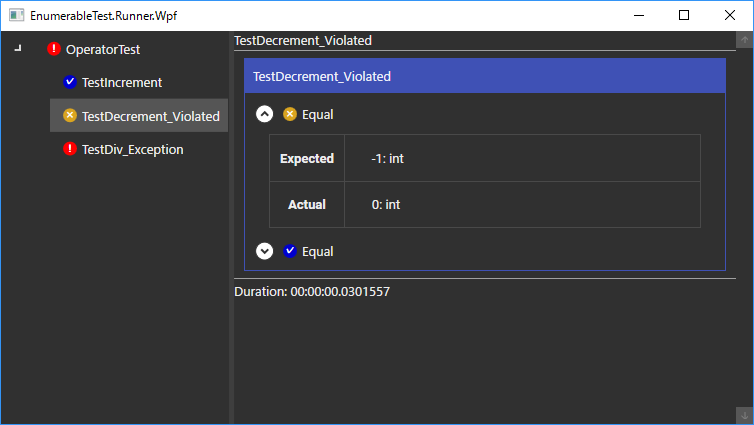

# EnumerableTest

A unit testing framework for .NET framework.

.NET フレームワーク向けの単体テストフレームワーク。

## Documents
[Tutorial (チュートリアル)](https://vain0.github.io/EnumerableTest/articles/tutorials/walk-aruond.html)

## Why?
**EnumerableTest** enables you to write parameterized tests easily because of two features:

(ja) **EnumerableTest** では、パラメーター化されたテストを記述するのが簡単です。その理由は次の2つの特徴にあります:

- **Continuous assertions** (継続する表明)
    - Even if an assertion is violated, the rest assertions are also evaluated. This prevents you from being suffered from test methods with many assertions.
    - (ja) いずれかの表明が不成立になったとしても、残りの表明は評価されます。そのため、1つのテストメソッドのなかで多数の表明を実行しても、問題ありません。
- **Test groups** (テストグループ)
    - Tests (assertions) can be grouped into a test.
    - (ja) 複数のテスト (アサーション) をまとめて1つのテストとして扱うことができます。

See the tutorial for more details.

(ja) 詳細はチュートリアルを参照してください。

### Barrier-free colors
Blue for the successful status, warm colors for bad statuses.

(ja) 成功を青で、失敗を暖色で表します。
